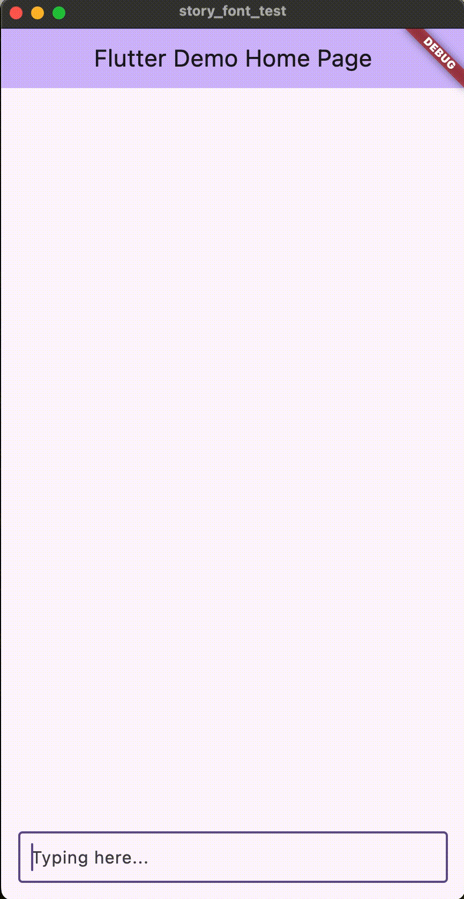

# Flutter Styled Text Widget

در این پروژه، یک ویجت متنی سفارشی ایجاد شده است که متن را به صورت دستی با استفاده از `TextPainter` رندر می‌کند و اندازه ویجت را بر اساس محتوای متن محاسبه می‌کند. این ویجت در یک کارت سفارشی با سایه ملایم قرار دارد و متن را در مرکز کارت نمایش می‌دهد.

  

---

## 📌 توضیحات فنی

چرا `LayoutBuilder`؟
---

چون:
بدون Constraints نمی‌توان اندازه دقیق متن را محاسبه کرد.

چرا `TextPainter`؟
---

چون به این موارد نیاز داریم:

اندازه واقعی متن

کنترل layout

کنترل paint

چرا `setState`؟
---

چون:
پیچیدگی خاصی نداریم و همین جواب نیاز ما را می دهد

